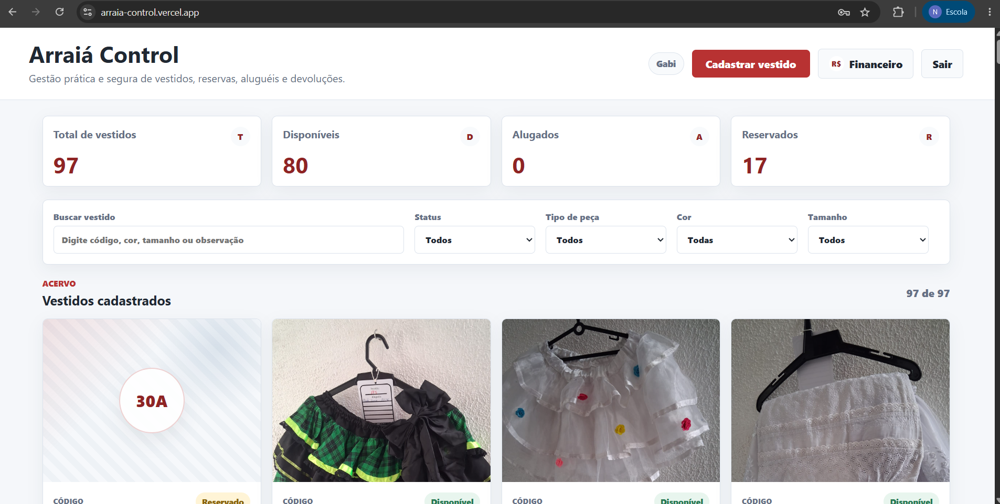
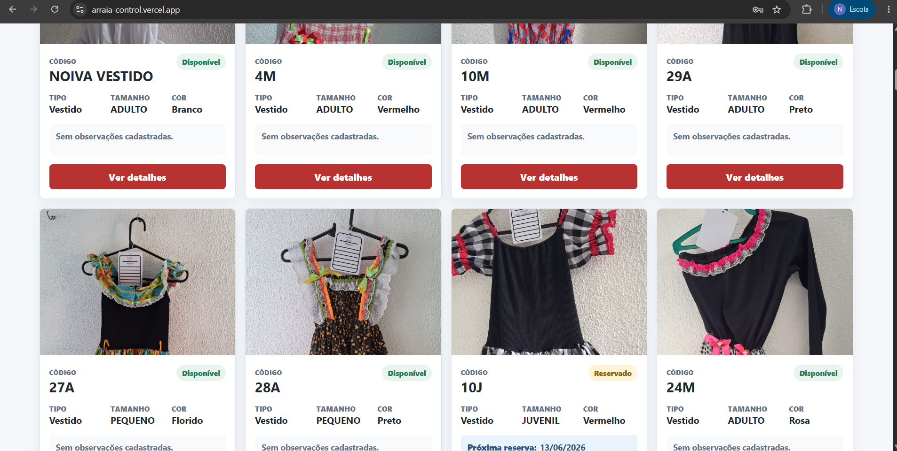
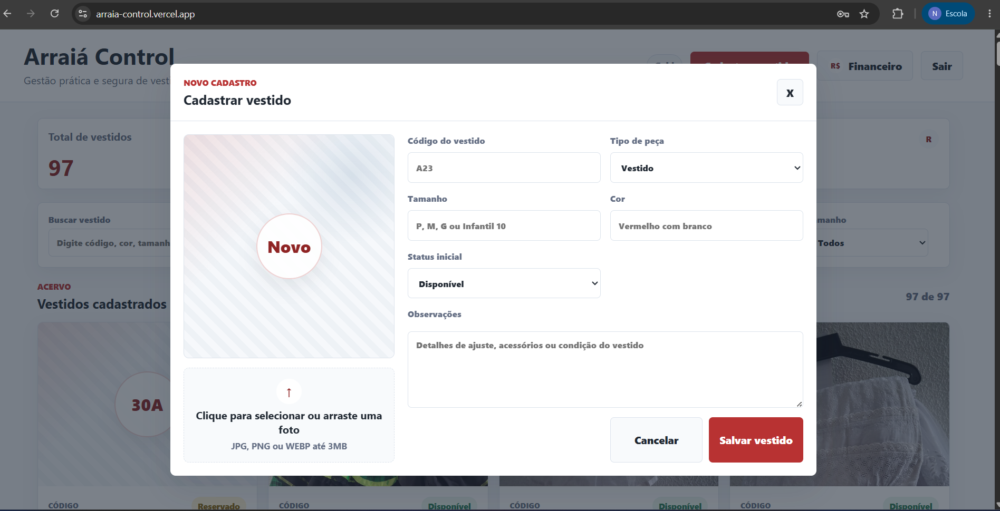
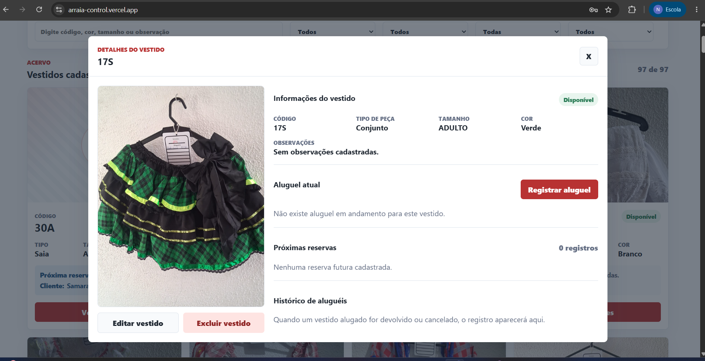
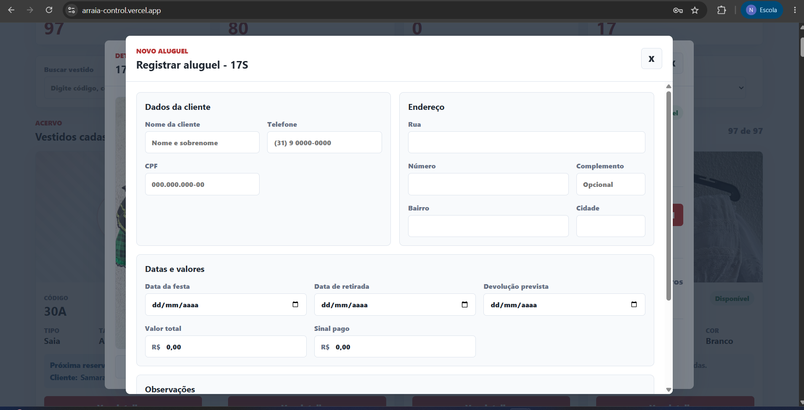
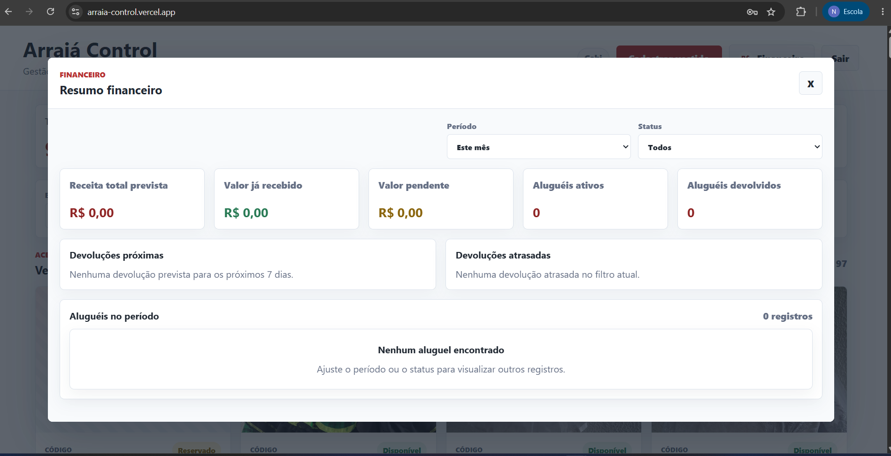

# Arraiá Control

Sistema web interno para controlar acervo, reservas, aluguéis, devoluções e acompanhamento financeiro de peças de quadrilha, com autenticação e persistência no Supabase.


## Visão Geral

O Arraiá Control foi desenvolvido para apoiar a operação de aluguel de vestidos e peças típicas de quadrilha. O sistema centraliza o cadastro do acervo, o controle de disponibilidade, a agenda de reservas, o histórico de devoluções e a visão financeira dos aluguéis.

O problema resolvido é a substituição de controles manuais, planilhas soltas e conferências informais por uma aplicação única, autenticada e conectada a um banco real. A aplicação atende usuárias internas responsáveis por cadastrar peças, registrar clientes, acompanhar retiradas/devoluções e consultar valores recebidos ou pendentes.

O objetivo principal é reduzir conflito de agenda, preservar histórico operacional e dar visibilidade rápida sobre o estado do acervo.

## Demonstração













## Funcionalidades

### Acesso e Sessão

- Login por e-mail e senha usando Supabase Auth.
- Verificação de sessão ativa ao iniciar a aplicação.
- Logout com limpeza de sessão local.
- Bloqueio do dashboard quando não existe sessão autenticada.

### Gestão do Acervo

- Cadastro, edição e exclusão de peças.
- Controle de código único por peça.
- Cadastro de tipo de peça: `Vestido`, `Saia`, `Conjunto` e `Blusa Xadrez`.
- Registro de tamanho, cor, status inicial, observações e foto.
- Upload de imagem para o bucket `dress-photos`.
- Validação de imagens nos formatos JPG, JPEG, PNG e WEBP, com limite de 3 MB.
- Listagem responsiva em cards com foto, código, tipo, tamanho, cor e status.
- Filtros por busca textual, status, tipo de peça, cor e tamanho.

### Aluguéis, Reservas e Devoluções

- Registro e edição de aluguel por peça.
- Cadastro de dados da cliente: nome, telefone, CPF e endereço estruturado.
- Registro de data da festa, retirada e devolução prevista.
- Registro de valor total, sinal pago e observações.
- Validação de CPF, telefone, período do aluguel e valores financeiros.
- Detecção de conflito de agenda para impedir sobreposição de aluguéis ativos.
- Separação visual entre aluguel atual, reservas futuras e histórico.
- Marcação de aluguel como devolvido.
- Cancelamento de aluguel ou reserva.
- Exclusão de registros do histórico quando já estão devolvidos ou cancelados.

### Status e Agenda

- Status visual calculado a partir dos aluguéis ativos.
- Peça marcada como `alugado` quando há aluguel ativo iniciado.
- Peça marcada como `reservado` quando há reserva futura.
- Sincronização do status persistido da peça após criação, edição, devolução ou cancelamento de aluguel.

### Financeiro

- Dashboard financeiro em modal dedicado.
- Filtros por período: este mês, próximo mês, últimos 30 dias, mês específico ou todos.
- Filtro por status do aluguel: ativo, devolvido, cancelado ou todos.
- Receita total prevista.
- Valor já recebido.
- Valor pendente.
- Contagem de aluguéis ativos e devolvidos.
- Listagem de devoluções próximas nos próximos 7 dias.
- Listagem de devoluções atrasadas.
- Tabela de aluguéis do período com peça, cliente, datas, valores e status.

### Experiência de Uso

- Interface responsiva construída com CSS próprio.
- Modais para cadastro, edição, detalhes e financeiro.
- Mensagens de sucesso, erro e carregamento.
- Confirmações antes de ações destrutivas ou irreversíveis.
- Placeholders visuais para peças sem foto cadastrada.

## Tecnologias Utilizadas

### Frontend

- React 19 (`react` e `react-dom` `^19.0.0`).
- JavaScript com ES Modules.
- CSS puro dividido por base global, layout, componentes e formulários.
- Vite 7 (`vite` `^7.0.0`) como dev server e ferramenta de build.

### Backend

- Não há backend Node/Express próprio neste repositório.
- A camada de serviços do frontend se comunica diretamente com o Supabase via `@supabase/supabase-js` `^2.106.1`.
- Supabase Auth é usado para autenticação com e-mail e senha.
- Supabase Storage é usado para armazenar fotos das peças.

### Banco de Dados

- Supabase Database, baseado em PostgreSQL.
- Tabelas principais: `dresses` e `rentals`.
- Extensão `pgcrypto` para geração de UUID com `gen_random_uuid()`.
- Constraints para status válidos.
- Índices para consultas por peça, status, data da festa e devolução prevista.
- Triggers para atualização automática de `updated_at`.
- Row Level Security habilitado para tabelas e storage.

### Infraestrutura

- Projeto Supabase com Database, Auth e Storage.
- Bucket público `dress-photos`, com limite de 3 MB e MIME types restritos.
- Build estático gerado pelo Vite em `dist`.
- Não há configuração de deploy versionada no repositório.

### Ferramentas de Desenvolvimento

- npm.
- `package-lock.json` para travamento de dependências.
- Git.
- Scripts SQL versionados em `supabase/`.
- `@vitejs/plugin-react` `^5.0.0`.
- Vite HMR para desenvolvimento local.

## Arquitetura

O projeto é uma Single Page Application em React. A aplicação não usa roteamento; o fluxo principal acontece em uma única tela autenticada, com modais para ações específicas.

O `App.jsx` concentra a orquestração da sessão, carregamento dos dados, estado dos filtros, seleção de peça e abertura dos modais. Os componentes em `src/components` cuidam da interface e recebem callbacks para executar operações.

A comunicação com o Supabase fica isolada em `src/services`:

- `authService.js` controla sessão, login e logout.
- `dressService.js` busca, cria, atualiza e exclui peças.
- `rentalService.js` busca, cria, atualiza, cancela e finaliza aluguéis.
- `imageService.js` valida e envia fotos para o Supabase Storage.
- `sanitizeService.js` normaliza entradas de texto antes de persistir.

As regras puras de domínio ficam em `src/utils`, incluindo cálculo de status visual, conflito de agenda, filtros, formatação e resumo financeiro.

O fluxo de dados principal é:

1. A usuária autentica com Supabase Auth.
2. A aplicação carrega peças e aluguéis do Supabase.
3. `dressService` compõe cada peça com aluguel atual, reservas futuras e histórico.
4. A interface exibe dashboard, filtros e cards.
5. As ações de cadastro, edição, devolução ou cancelamento chamam serviços.
6. Após cada mutação, a lista é recarregada para manter a tela sincronizada.

Essa organização mantém as responsabilidades separadas sem adicionar complexidade desnecessária para o tamanho atual do produto.

## Estrutura de Pastas

```text
.
|-- docs/
|   `-- images/                 # Screenshots usados na seção de demonstração
|-- src/
|   |-- components/             # Componentes visuais e modais da aplicação
|   |-- lib/                    # Cliente Supabase e validação de configuração
|   |-- services/               # Operações de autenticação, peças, aluguéis e imagens
|   |-- styles/                 # CSS global, layout, componentes e formulários
|   |-- utils/                  # Regras puras, filtros, agenda e formatação
|   |-- App.jsx                 # Orquestração principal da SPA
|   `-- main.jsx                # Bootstrap React
|-- supabase/
|   |-- migrations/             # Migrações incrementais usadas no banco
|   `-- schema.sql              # Schema consolidado, RLS, triggers e bucket
|-- .env.example                # Variáveis necessárias para conexão com Supabase
|-- index.html                  # Documento HTML servido pelo Vite
|-- package.json                # Dependências e scripts npm
`-- vite.config.js              # Configuração do Vite com plugin React
```

`node_modules` e `dist` não são documentados como estrutura do projeto porque são diretórios gerados localmente.

## Instalação

### Pré-requisitos

- Node.js compatível com Vite 7: `^20.19.0` ou `>=22.12.0`.
- npm.
- Projeto Supabase ativo.
- Usuário interno criado em Supabase Authentication.

### Passo a Passo

Clone o repositório:

```bash
git clone https://github.com/natanaelhauck/arraia-control.git
cd arraia-control
```

Instale as dependências:

```bash
npm install
```

Crie o arquivo `.env` a partir do exemplo:

```bash
cp .env.example .env
```

Preencha as variáveis do Supabase no `.env`:

```env
VITE_SUPABASE_URL=sua_url_do_supabase
VITE_SUPABASE_ANON_KEY=sua_chave_anonima_do_supabase
```

Configure o banco:

1. Crie um projeto no Supabase.
2. Abra o SQL Editor.
3. Execute o conteúdo de `supabase/schema.sql`.
4. Confirme a criação das tabelas `dresses` e `rentals`.
5. Confirme a criação do bucket `dress-photos`.
6. Crie os usuários internos em Authentication > Users.

Inicie o ambiente local:

```bash
npm run dev
```

Gere a build de produção:

```bash
npm run build
```

Visualize a build localmente:

```bash
npm run preview
```

## Variáveis de Ambiente

As variáveis versionadas estão em `.env.example`.

| Variável | Obrigatória | Uso |
| --- | --- | --- |
| `VITE_SUPABASE_URL` | Sim | URL do projeto Supabase usada pelo cliente web. |
| `VITE_SUPABASE_ANON_KEY` | Sim | Chave pública anon do Supabase usada no frontend autenticado. |

Não existem outras variáveis de ambiente documentadas no código. O arquivo `.env` real não deve ser versionado.

Nunca use a `service_role key` no frontend. A aplicação foi construída para operar com a anon key, Supabase Auth e políticas RLS.

## Scripts Disponíveis

| Script | Comando | Descrição |
| --- | --- | --- |
| `npm run dev` | `vite` | Inicia o servidor de desenvolvimento com HMR. |
| `npm run build` | `vite build` | Gera a build estática em `dist`. |
| `npm run preview` | `vite preview` | Serve localmente a build gerada. |

O repositório ainda não possui scripts de testes automatizados, lint ou formatação.

## Decisões Técnicas

- **Supabase como backend gerenciado:** evita manter um servidor próprio e entrega Auth, Database, Storage e RLS em uma única plataforma.
- **Serviços isolados no frontend:** operações externas ficam fora dos componentes, facilitando manutenção e leitura.
- **Regras puras em `utils`:** filtros, status visual, conflito de agenda e cálculos financeiros podem evoluir sem acoplar à UI.
- **Status visual calculado pela agenda:** o status exibido considera aluguéis atuais e reservas futuras, reduzindo divergência operacional.
- **Validação em múltiplas camadas:** formulários validam dados antes do envio, enquanto o banco mantém constraints para status e unicidade de código.
- **Fotos em bucket público:** simplifica a exibição das imagens nesta fase. Para produção com fotos sensíveis, a evolução natural é usar URLs assinadas.
- **CSS próprio e responsivo:** o projeto não depende de biblioteca visual externa, mantendo controle direto sobre layout e estados.
- **Sem roteador neste estágio:** a experiência atual é centrada em um dashboard operacional único, então modais atendem melhor ao fluxo existente.

## Melhorias Futuras

- Criar testes automatizados para regras de agenda, conflitos de aluguel e cálculos financeiros.
- Adicionar pipeline de CI com build e validações antes de merge.
- Implementar perfis e níveis de permissão por usuária.
- Registrar auditoria de ações críticas, como exclusão, cancelamento e devolução.
- Evoluir o financeiro com controle de pagamento final, baixa manual e status de quitação.
- Criar campos específicos para forma de pagamento e comprovantes.
- Usar URLs assinadas caso as fotos deixem de ser públicas.
- Adicionar paginação ou busca remota se o volume do acervo crescer.
- Configurar deploy e domínio de produção.
- Definir rotina de backup e restauração do banco.

## Aprendizados

- Integração de uma SPA React com Supabase Auth, Database e Storage.
- Modelagem de um fluxo real de aluguel com agenda, devolução e histórico.
- Implementação de regras de disponibilidade baseadas em intervalos de datas.
- Separação entre componentes visuais, serviços de dados e regras de domínio.
- Uso de RLS e policies para restringir acesso a usuárias autenticadas.
- Construção de uma interface responsiva sem depender de biblioteca de UI.
- Tratamento de validação, mensagens de erro e estados de carregamento em uma aplicação operacional.

## Diferenciais do Projeto

- Resolve um problema real de operação, com domínio claro e fluxo completo.
- Usa persistência real, autenticação e storage, não apenas estado local.
- Possui schema SQL versionado com constraints, índices, triggers e RLS.
- Implementa prevenção de conflito de agenda para aluguéis ativos.
- Inclui dashboard financeiro derivado dos registros reais de aluguel.
- Mantém separação pragmática entre UI, serviços e regras de negócio.
- Apresenta telas responsivas e preparadas para demonstração visual em portfólio.

## Documentação Técnica Complementar

- [Relatório de lock de arquivo no Windows](docs/windows-file-lock.md)
